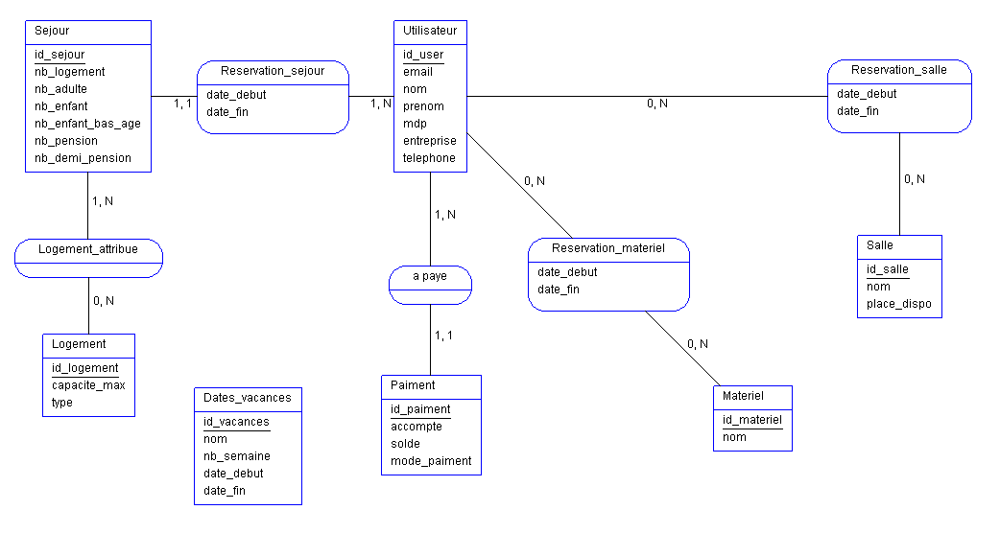
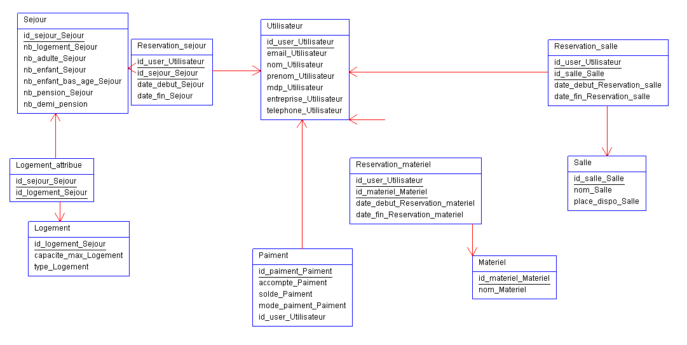

# Projet_Php_Bts1
# Edouard Quilliou ~ Jonas Groetschel

###Projet : He's gonna step on the gas!!!
###Pour créer la base de donnée utilisée par le site, copier le fichier "les_rousses.sql" dans la console MySQL puis exécuter le script "insert_into_data.php".

